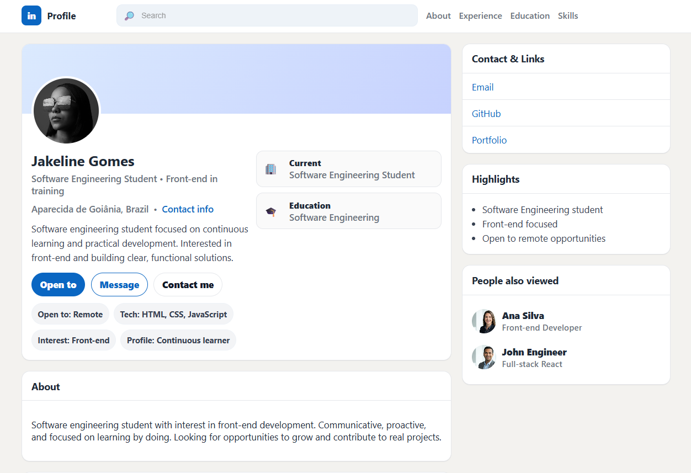

# LinkedIn Profile Clone

A profile page project inspired by the LinkedIn layout, developed using **HTML and CSS**, focusing on structure, semantics, and component styling.

## 📌 Purpose
Practice building modern layouts, code organization (indentation and best practices), and simulate a professional profile for portfolio purposes.

## 🛠️ Technologies Used
- HTML5  
- CSS3  
- Flexbox  
- Responsive layout

## ✨ Features
- Header with profile photo
- Main user information
- About section
- Professional experience
- Education section
- Skills and Languages
- Highlights with pills/chips
- Sidebar with *People also viewed*
- Customized footer

## 📸 Preview
Visual project inspired by LinkedIn, featuring circular profile images and well-organized cards.



## 🚀 How to Run the Project
1. Clone the repository:
   ```bash
   git clone https://github.com/Jakelinegomes32/cv-profile-linkedin-style.git
   
2. Open the index.html file in your browser.

📚 What I Learned

Semantic HTML structure

Importance of indentation

Using Flexbox for alignment

Visual organization of components

Replicating real-world product layouts

---

Jakeline Gomes

Software Engineering Student

Front-end focused and continuous learner

---

Original project: LinkedIn Clone
Author: Alexandre Calaça
Platform: CodePen
